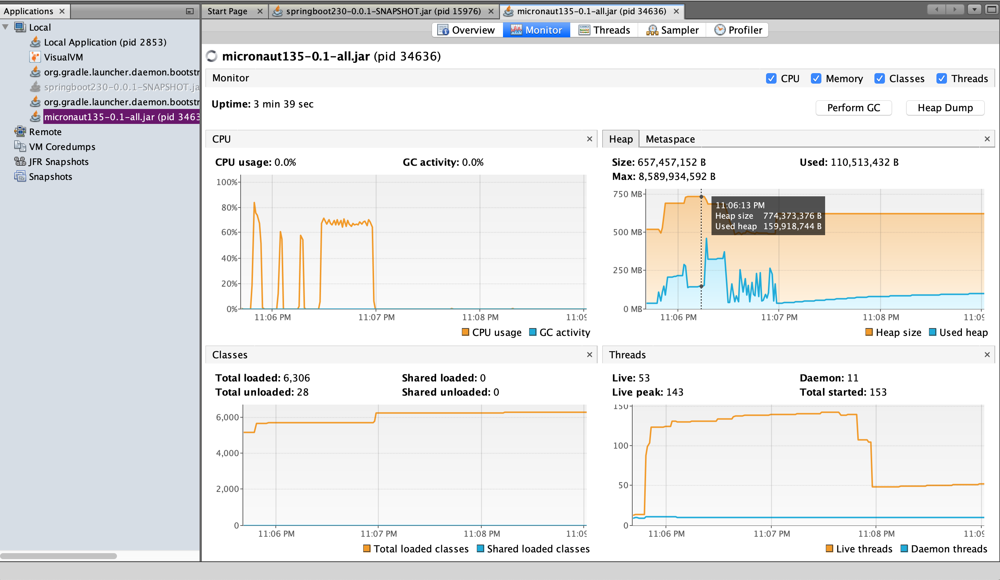
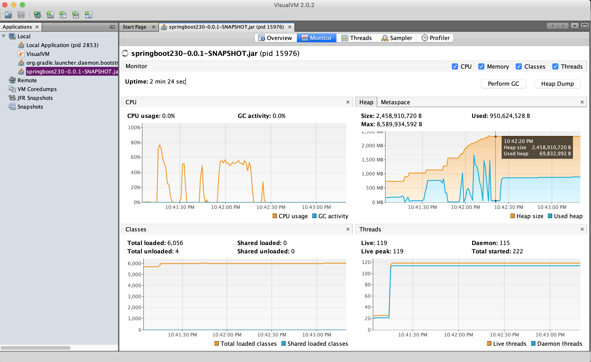

# benchmark SpringBoot vs Micronaut

This benchmark is based on a load test script for a simple API,
unique endpoint that returns the number of requests it has processed.

To make this clear I've been running this test several times.

## SpringBoot 2.2.1.RELEASE

> command to generate project:
>
> spring init -d=web --groupId=net.demo --build=gradle springboot211

## Micronaut 1.2.6

> command to generate project:
>
> mn create-app net.demo.micronaut126

## Details

The load test is a bash script and I'm using multiple tools for this:

 - http: https://httpie.org/
 - hey: https://github.com/rakyll/hey
 - wrk: https://github.com/wg/wrk

How it works is:

Always hits `/helloWork` endpoint, it triggers bursts in different sequences

 1. hits once
 2. hits 100k using 100 connections
 3. sleep for 10s
 4. hits 100k using 100 connections
 5. sleep for 10s
 6. hits 100k using 100 connections
 7. sleep for 10s
 8. hits for 30 seconds using 100 connections
 9. hits only once

you can check this [script in this gist][load_test]

I used [VisualVM][] to monitor each app.

```bash
visualvm --jdkhome /Users/markox/.sdkman/candidates/java/current/
```

## Conclusions

- As you can verify in monitor tab, Micronaut keeps better memory consumption.

- Regarding to number of requests processed ~27.7% more request for Micronaut, something to mention is that very few times SpringBoot throws an error *connection reset by peer*.

- In terms of CPU usage is quite fair for both of them.

- SpringBoot always loads more classes that Micronaut

- About number of threads is not clear, sometimes SpringBoot runs more some others Micronaut does run more

- Micronaut has faster startup most of the times, but SpringBoot very few times was pretty close.

### Update new framework versions

- This new bersion of microanut loads a little more classes than SpringBoot 2.3.0 but less than previous version 

- App startup still getting better for both framewoks but Micronaut almost hitting 1 second barrier

- Memory consumption Micronaut got better performance over all by keeping solid memory head usage while SpringBoot went a little higher than previous version

### Max head memory:

SpringBoot 2.2.1: 2079326208 B (~1.9 Gb)
SpringBoot 2.3.0: 2458910720 B (~2.3 Gb)

Micronaut 1.2.6:  1074266112 B (~1Gb)
Micronaut 1.3.5:  774373376 B (~738.5Mb)

### Total Request:

SpringBoot 2.2.1: 1,934,000
SpringBoot 2.3.0: 1,921,902

Micronaut 1.2.6:  2,678,041
Micronaut 1.3.5:  2,846,333

Overall Micronaut has been having better head memory consumption and able to process way more request than SpringBoot.

### Micronaut 1.2.6 monitor


### Micronaut 1.3.5 monitor


### SpringBoot 2.2.1 monitor


### SpringBoot 2.3.0 monitor


[load_test]: https://gist.github.com/Markitox/9c178e12de45df114142cd568dde3876
[VisualVM]: https://visualvm.github.io/
